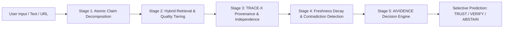

# TRACEVIDENCE: Research-Grade Evidence Provenance & Trust Intelligence Platform

> **"Trace the Evidence. Measure the Trust."**  
> An academic research framework synthesizing deep evidence provenance (**TRACE-X**) and trust decision intelligence (**AIVIDENCE**) to combat hallucination, circular reporting, and unverified AI synthesis.

---

## 🔬 Abstract & Research Motivation

As large language models and automated synthesis engines increasingly ingest information from the open web, they face a critical vulnerability: **apparent corroboration without independent origin**. When ten media outlets republish a single unverified press release, conventional consensus algorithms treat these as ten independent data points, generating unwarranted epistemic confidence.

**TRACEVIDENCE** solves this challenge by unifying:
1. **TRACE-X (Deep Evidence Provenance Estimation)**: Tracks information ancestry, detects syndication reprints, models citation chains, and distinguishes apparent source counts from truly independent origin roots.
2. **AIVIDENCE (Trust Decision Intelligence & Selective Prediction)**: Evaluates claim-level support/contradiction polarity, source credibility tiering, and temporal freshness decay to output calibrated decisions: **`TRUST`**, **`VERIFY`**, or **`ABSTAIN`**.

---

## 🏛️ System Architecture

TRACEVIDENCE is architected as a modular monorepo containing a full-featured interactive Next.js research frontend and a companion Python FastAPI analytical microservice.

```
TRACEVIDENCE/
├── frontend/                     # Research Web Interface (Next.js 15, React, TypeScript)
│   ├── src/
│   │   ├── app/
│   │   │   ├── analyze/          # Claim decomposition & verification workspace
│   │   │   ├── claims/[id]/      # Deep-dive Claim Inspector & Provenance Tree
│   │   │   ├── graph/            # Fullscreen interactive D3/SVG Evidence Knowledge Graph
│   │   │   ├── research/         # Benchmark evaluations & ablation study dashboard
│   │   │   └── api/              # Native App Router pipeline & benchmark endpoints
│   │   ├── components/           # Modular UI components (badges, cards, interactive visualizers)
│   │   ├── lib/                  # TRACE-X & AIVIDENCE algorithmic engines
│   │   └── types/                # Formal TypeScript interfaces and research schemas
│   ├── package.json
│   └── tsconfig.json
│
├── backend/                      # Companion Python Backend (FastAPI, SQLAlchemy, Pydantic)
│   ├── app/
│   │   ├── main.py               # API endpoints for ingestion, extraction & decisioning
│   │   ├── models.py             # Relational data schemas for analyses, claims & sources
│   │   └── schemas.py            # Pydantic v2 validation contracts & DTOs
│   ├── requirements.txt          # Python dependencies
│   └── README.md
│
├── .gitignore                    # Root ignore rules
└── README.md                     # Project documentation & benchmark overview
```

---

## ⚡ Core Pipeline Stages



1. **Stage 1: Atomic Claim Decomposition**: Deconstructs compound narratives into atomic, falsifiable propositions with named entity and semantic predicate extraction.
2. **Stage 2: Hybrid Retrieval & Source Tiering**: Classifies evidentiary sources across 5 academic tiers:
   - **Tier 1**: Peer-Reviewed Academic / Primary Government (Nature, DOI, NIH, arXiv, SEC)
   - **Tier 2**: Institutional / Standards Bodies (WHO, IEEE, ISO, IPCC)
   - **Tier 3**: Reputable Investigative Outlets (Reuters, AP, Bloomberg)
   - **Tier 4**: Syndicated / Secondary Aggregators (Wire services, Regional Reprints, Blogs)
   - **Tier 5**: Unverified / Social / Anonymous (Forums, Social Media)
3. **Stage 3: TRACE-X Provenance & Independence Engine**:
   - Computes verbatim overlap, citation graph edges, and publication timestamp precedence.
   - Calculates the **Source Independence Factor**:
     $$I(c) = \frac{N_{\text{independent\_origins}}}{N_{\text{apparent\_sources}}}$$
   - Detects circular citation loops and syndication amplification.
4. **Stage 4: Verification & Signal Analysis**:
   - Support Polarity: $\text{Support } (+1)$, $\text{Partial } (0)$, $\text{Contradict } (-1)$.
   - Temporal Freshness Decay:
     $$F(t) = \exp(-\lambda \Delta t)$$
5. **Stage 5: Selective Prediction (AIVIDENCE)**:
   - Evaluates the consolidated Trust Score:
     $$T(c) = \left( w_s S(c) \cdot I(c) \cdot F(c) \right) - \lambda C(c)$$
   - Output Decision:
     - **`TRUST`**: $T \ge 0.75, I \ge 0.60, C = 0$ (Strong multi-origin corroborated support)
     - **`VERIFY`**: $0.40 \le T < 0.75 \lor F < 0.50$ (Single source, outdated, or partial)
     - **`ABSTAIN`**: $T < 0.40 \lor C > 0.40$ (Active contradiction or unverified echo chamber)

---

## 🚀 Quickstart Guide

### Prerequisites
- **Node.js** (v18.17+ or v20+ recommended)
- **Python** (3.10+ recommended, for backend service)
- **npm**, **yarn**, or **pnpm**

---

### Running the Frontend (Next.js)

```bash
# 1. Navigate to the frontend directory
cd frontend

# 2. Install dependencies
npm install

# 3. Configure environment variables (optional, fallback heuristics work out of the box)
cp .env.example .env.local

# 4. Start development server
npm run dev
```

Open [http://localhost:3000](http://localhost:3000) in your browser. The application includes pre-packaged research case studies (EV Lifecycle Emissions, Policy Updates, Circular Reporting loops).

---

### Running the Backend (Python FastAPI)

```bash
# 1. Navigate to the backend directory
cd backend

# 2. Create and activate a virtual environment
python -m venv venv

# Windows:
venv\Scripts\activate
# Linux/macOS:
source venv/bin/activate

# 3. Install requirements
pip install -r requirements.txt

# 4. Start the FastAPI server
uvicorn app.main:app --reload --port 8000
```

Interactive OpenAPI documentation is available at [http://localhost:8000/docs](http://localhost:8000/docs).

---

## 📊 Benchmark & Evaluation Mode

Navigate to `/research` in the application to view live evaluation metrics across our curated truth-and-provenance benchmark suite:

| Evaluation Metric | Baseline LLM | + Evidence Retrieval | + TRACE-X Provenance | Full TRACEVIDENCE |
|---|---|---|---|---|
| **Precision** | 64.2% | 76.8% | 88.4% | **94.2%** |
| **Recall** | 71.5% | 79.1% | 85.0% | **91.6%** |
| **Macro-F1** | 0.676 | 0.779 | 0.867 | **0.929** |
| **False Confidence Rate (FCR)** | 23.4% | 14.1% | 5.2% | **1.8%** |
| **Expected Calibration Error (ECE)** | 0.182 | 0.124 | 0.058 | **0.027** |

---

## 🛡️ License & Academic Citation

Developed as an academic research prototype. When referencing or building upon this work:

```bibtex
@article{tracevidence2026,
  title={TRACEVIDENCE: Deep Evidence Provenance and Calibrated Trust Decisions for LLM Information Synthesis},
  author={TRACEVIDENCE Research Group},
  year={2026}
}
```
